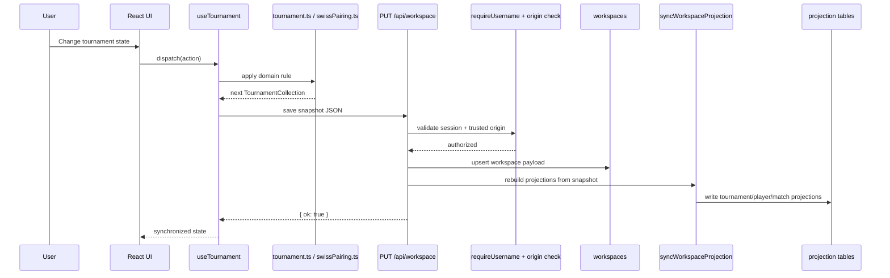
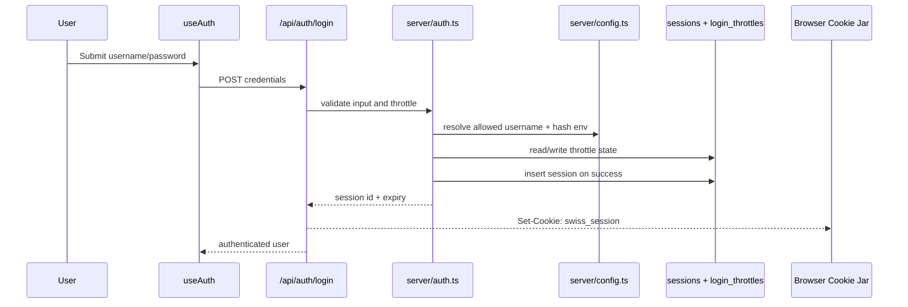

# Swiss Tournaments System Diagram

This diagram shows the main runtime components of the app and how information flows between them.

## High-Level System Diagram

```mermaid
flowchart TD
  U[Organizer User]
  B[Browser / PWA Shell]

  subgraph FE[Frontend: React + TypeScript + Vite]
    M[main.tsx]
    I18N[I18nProvider]
    APP[App.tsx]

    subgraph HOOKS[State / Data Hooks]
      AUTH[useAuth]
      TOUR[useTournament]
      LIB[usePlayerLibrary]
      STATS[usePlayerStats]
      H2H[useHeadToHead]
      PWA[useInstallPrompt]
    end

    subgraph UI[UI Components]
      DASH[Dashboard / Live / Standings / Statistics / Head-to-Head]
      CONTROLS[TournamentControls]
      PLAYERS[PlayerList]
      PAIRINGS[PairingsView]
      STANDINGS[StandingsTable]
    end

    subgraph DOMAIN[Client Domain Logic]
      TOURNAMENT[tournament.ts]
      RANKING[ranking.ts]
      SWISS[swissPairing.ts]
      EXPORT[export + report utils]
    end
  end

  subgraph API[Backend: Vercel Serverless Routes]
    SESSION_API[/api/auth/session]
    LOGIN_API[/api/auth/login]
    LOGOUT_API[/api/auth/logout]
    WORKSPACE_API[/api/workspace]
    LIB_API[/api/player-library]
    STATS_API[/api/player-stats]
    H2H_API[/api/head-to-head]
    HEALTH_API[/api/health]
  end

  subgraph SERVER[Server Modules]
    AUTH_SRV[server/auth.ts]
    HTTP_SRV[server/http.ts]
    LIB_SRV[server/library.ts]
    DB_SRV[server/db.ts]
    CFG_SRV[server/config.ts]
    WS_SRV[server/workspace.ts]
  end

  subgraph DB[Neon Postgres]
    SESS[(sessions)]
    THROTTLE[(login_throttles)]
    WS[(workspaces JSONB)]
    PLAYER_LIB[(player_library)]
    T_REC[(tournament_records)]
    T_PLAY[(tournament_player_entries)]
    T_MATCH[(tournament_match_entries)]
  end

  U --> B
  B --> M
  M --> I18N
  I18N --> APP

  APP --> AUTH
  APP --> TOUR
  APP --> LIB
  APP --> STATS
  APP --> H2H
  APP --> PWA

  APP --> DASH
  DASH --> CONTROLS
  DASH --> PLAYERS
  DASH --> PAIRINGS
  DASH --> STANDINGS

  CONTROLS --> TOUR
  PLAYERS --> TOUR
  PAIRINGS --> TOUR
  STANDINGS --> RANKING

  TOUR --> TOURNAMENT
  TOURNAMENT --> RANKING
  TOURNAMENT --> SWISS
  DASH --> EXPORT

  AUTH --> SESSION_API
  AUTH --> LOGIN_API
  AUTH --> LOGOUT_API
  TOUR --> WORKSPACE_API
  LIB --> LIB_API
  STATS --> STATS_API
  H2H --> H2H_API

  SESSION_API --> AUTH_SRV
  LOGIN_API --> AUTH_SRV
  LOGOUT_API --> AUTH_SRV

  WORKSPACE_API --> AUTH_SRV
  WORKSPACE_API --> HTTP_SRV
  WORKSPACE_API --> LIB_SRV
  WORKSPACE_API --> WS_SRV
  WORKSPACE_API --> DB_SRV

  LIB_API --> AUTH_SRV
  LIB_API --> HTTP_SRV
  LIB_API --> LIB_SRV

  STATS_API --> AUTH_SRV
  STATS_API --> HTTP_SRV
  STATS_API --> LIB_SRV

  H2H_API --> AUTH_SRV
  H2H_API --> HTTP_SRV
  H2H_API --> LIB_SRV

  AUTH_SRV --> CFG_SRV
  AUTH_SRV --> DB_SRV
  LIB_SRV --> DB_SRV
  WS_SRV --> DB_SRV

  AUTH_SRV --> SESS
  AUTH_SRV --> THROTTLE
  WORKSPACE_API --> WS
  LIB_SRV --> PLAYER_LIB
  LIB_SRV --> T_REC
  LIB_SRV --> T_PLAY
  LIB_SRV --> T_MATCH
```

## Workspace Save and Projection Sync



## Auth and Session Flow



## Read Paths for Derived Data

```mermaid
flowchart LR
  WS[(workspaces JSONB)] -->|sync on save| PROJ[Projection Builder]
  PROJ --> PLAYER_LIB[(player_library)]
  PROJ --> T_REC[(tournament_records)]
  PROJ --> T_PLAY[(tournament_player_entries)]
  PROJ --> T_MATCH[(tournament_match_entries)]

  PLAYER_LIB --> LIB_API[/api/player-library]
  T_REC --> STATS_API[/api/player-stats]
  T_PLAY --> STATS_API
  T_MATCH --> STATS_API
  T_REC --> H2H_API[/api/head-to-head]
  T_PLAY --> H2H_API
  T_MATCH --> H2H_API

  LIB_API --> LIB_HOOK[usePlayerLibrary]
  STATS_API --> STATS_HOOK[usePlayerStats]
  H2H_API --> H2H_HOOK[useHeadToHead]
```

## Interpretation Notes

- The frontend is the primary mutation engine for live tournament behavior.
- The backend is the persistence, authentication, and analytics layer.
- `workspaces.payload` is the editable source snapshot.
- projection tables are query-optimized derivatives of that snapshot.
- statistics and head-to-head views do not directly read the workspace JSON during normal operation.
- pairing quality is handled in the client domain layer before persistence.
